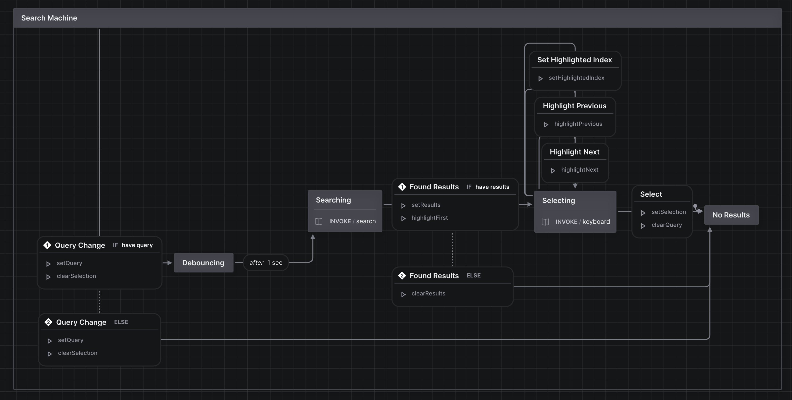

# Search State Machine

This is a state machine that I created for a conference talk.

## Install

```bash
bun
```

## Run

```bash
bun dev
```

...and open [localhost:3000](http://localhost:3000).

## Demo


## State Chart


